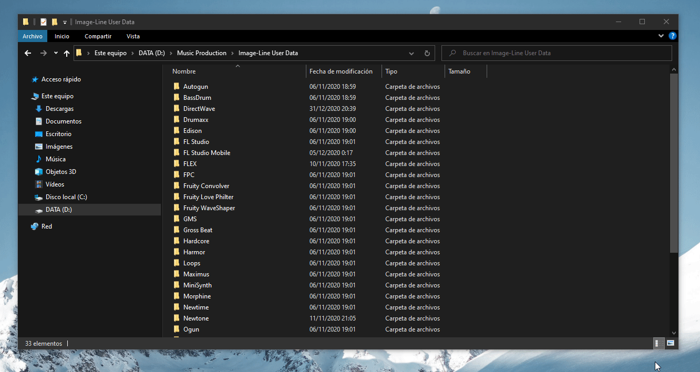
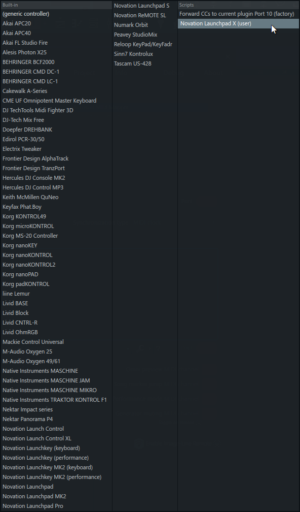

=======
The API
=======

Now that you know both Python and your MIDI device, it's time to get into the specifics of MIDI scripting in FL Studio.

Technical details
=================

The FL Studio MIDI scripting API was introduced in FL Studio 20.7, and allows developers external to Image-Line to integrate
MIDI devices with FL Studio.

It is powered by a stripped down custom Python 3.6 interpreter. The interpreter reads the 
scripts and interacts with the MIDI engine inside FL Studio as well as with some parts of the program itself, using Python 
as the language you use to interact with it, but it does not guarantee any kind of similarities with regular Python 
environments aside from that.  It DOES NOT provide access to any kind of function, method or code that might alter the 
end user's PC in any way (it is suspected that it's due to security reasons).

Scripts loaded by this interpreter aren't used as normal Python scripts with a ``main()`` method and their own logic, 
but as a definition of actions FL Studio has to execute when a certain event happens on the software.

These events will trigger the "Script events" defined in your code: a set of methods with pre-established names every script 
has to define in order for their code to be run by FL Studio. Each script event method will get called under certain circumstances, 
which we will talk about in further articles.

Setup and workflow
==================

Since the Python interpreter is directly built into FL Studio, you can't use it as you would with a regular Python interpreter.

Making your script appear in FL Studio
--------------------------------------

In order to make FL Studio detect the ``.py`` files you write as runnable MIDI scripts, you have to satisfy some requirements:

Location
........

MIDI scripts made by users have to be located inside a specific subfolder of their FL Studio "User data folder".
If you don't know its location on your PC, launch FL Studio, go to *Options > File settings* and check the "User data folder" setting.
Inside this folder there will be several folders with names matching Image-Line products names.

Inside the User data folder, ``/FL Studio/Settings/Hardware`` will contain folders for each of the MIDI scripts you load in your system to 
use in FL Studio. The ``.py`` files and modules you create **must** be located inside one of these subfolders:

* **User data folder**
  
  - **FL Studio**

    * **Settings**

      - **Hardware**

        * Controller script folder 1

          - Main ``.py`` file

        * Controller script folder 2

          - Main ``.py`` file

        * ...

Naming
......

* **Controller script folder:** The folder your script is going to be located on can have any name you want. Just name it to something 
  meaningful, like the name of your controller (for example, ``Novation Launchpad X``).

* **Main** ``.py`` **file:** The ``.py`` file FL Studio will load must have a name following this convention: ``device_[whatever you want].py``.
  
  Just as with the controller script folder, the name of the ``.py`` file is up to you. However, a ``device_`` prefix **must** appear at the 
  beginning of the name in order for FL Studio to detect it as a MIDI script file. This will tell FL Studio that's the Python file it has to load 
  in first place, and the one that contains the script event definitions.

  Inside the Python file you will also have to define the name FL Studio will use to represent your script inside the "Controller type" list 
  on the MIDI settings window. This is done by writing a comment on the first line of the file:

  .. code-block:: python
  
     # name=[name of your device]
  
  Any other Python source files can be named to whatever you want. Just be sure there's at least one ``.py`` file inside the controller script folder 
  to ensure FL Studio detects it.

  .. tip::  You can also specify a URL on the script for support like this:

            .. code-block:: python

               # name=[name of your device]
               # url=[url]

            You can use any URL of your choice there, but there's something to keep in mind. Next to the *Controller type* list dropdown there's a help 
            button:

            .. image:: _resources/fl_midi_api/midi_settings_help_icon.png

            If your end user clicks that button and your link doesn't belong to the domain ``forum.image-line.com``, it will redirect your user to the 
            `MIDI Controller Scripting forum main page <https://forum.image-line.com/viewforum.php?f=1994>`__  from Image-Line. But if the link you 
            specify belongs to the Image-Line forum, it will redirect your end user to the specific topic you linked.
            
            With this in mind, the best practice would be to link to the thread on the scripting forum you use to "announce" your scripts, post updates and 
            provide support on.

            .. code-block:: python

               # name=Example script
               # url=https://forum.image-line.com/viewtopic.php?f=1994&t=225476

               # The URL link redirects to the "Getting Started | Simple Scripts to control things in FL Studio" thread on the Image-Line forums.

Let's see how it would look like if we wanted to make a script for the Launchpad X:

|

Then, on FL Studio's MIDI settings window, on the *Controller type* list your script will appear as ``[Controller name we specified inside the .py file] (user)``:

Running your script
-------------------

In order for your script to be run by FL Studio's Python interpreter you have to assign it to a MIDI device. Go to the MIDI Settings window, select the device you want
and assign a port to it on both Input and Output lists.

The port you assign it to is up to you but it must be unique to that MIDI device. Do not assign an already used port number by any other MIDI device in your
FL Studio settings, as that might cause your script to malfunction. Pass this indication as well to your end user in order to avoid bad script setups.

.. note::   On Windows and with some MIDI devices you might get an error from FL Studio saying something like "There wasn't enough memory to execute this operation"
            when trying to assign a port to it. If this happens to you, just take the MIDI device you assigned a port to and unassign it leaving its port number empty.

            Some MIDI devices aren't meant to either output information to your PC or receive information from it. Windows detects this and the port assignment step
            fails, throwing a memory error that in reality it doesn't have nothing to do with your PC's RAM memory but with an exception on the Windows Win32 API that
            is caused when FL Studio tries to assign a port on either the Input or Output list and the device is not meant to act like that.

            Releasing the device from the assigned port in both MIDI device lists (Input and Output) is needed in order to prevent FL Studio automatically re-assign it
            on the next program launch.

Modules
=======

The vast majority of the standard Python modules (mainly the ones used to interact with the system) are absent from this interpreter 
(``cpython``, ``pip``, ``threading``...). Instead you use FL Studio's own custom modules (some of them are built into the interpreter) 
as well as some of the still included standard Python modules that didn't got removed from the interpreter and any "portable" 
(``.py`` file(s) that don't rely in any other non-standard Python module) modules you might find.

Built-in modules
----------------

You can get a list of all the built-in modules on the FL Studio Python interpreter by entering the following lines on ``View > Script 
output > Interpreter``:

.. code-block:: python
   
   import sys
   sys.builtin_module_names

This way, FL Studio wil return a list with all the available built-in (directly embedded, written in C) modules on the FL interpreter:

.. code-block:: python

   ('_ast', '_bisect', '_blake2', '_codecs', '_codecs_cn', '_codecs_hk', '_codecs_iso2022', '_codecs_jp', '_codecs_kr', '_codecs_tw', '_collections', 
   '_csv', '_datetime', '_findvs', '_functools', '_heapq', '_io', '_json', '_locale', '_lsprof', '_md5', '_multibytecodec', '_opcode', '_operator', 
   '_random', '_sha1', '_sha256', '_sha3', '_sha512', '_signal', '_sre', '_stat', '_string', '_struct', '_symtable', '_thread', '_tracemalloc', '_warnings', 
   '_weakref', 'arrangement', 'array', 'atexit', 'audioop', 'binascii', 'builtins', 'channels', 'cmath', 'device', 'errno', 'faulthandler', 'gc', 'general', 
   'itertools', 'launchMapPages', 'marshal', 'math', 'mixer', 'mmap', 'parser', 'patterns', 'playlist', 'plugins', 'screen', 'sys', 'time', 'transport', 'ui', 
   'xxsubtype', 'zipimport', 'zlib')

Here are a few tables with more details:

.. table:: **Relevant standard Python modules (built-in)**
   :widths: 15 75 10

   +--------------------+--------------------------------------------------------------------------------------------------------------------------------------+-----------------------------------------------------------------------------------+
   | Module             | Description                                                                                                                          | Documentation                                                                     |
   +====================+======================================================================================================================================+===================================================================================+
   | ``_datetime``      | Geographical date and time handling module. More object oriented.                                                                    | `Python Documentation <https://docs.python.org/3.6/library/datetime.html>`__      |
   +--------------------+--------------------------------------------------------------------------------------------------------------------------------------+-----------------------------------------------------------------------------------+
   | ``_collections``   | Alternative container datatypes.                                                                                                     | `Python Documentation <https://docs.python.org/3.6/library/collections.html>`__   |
   +--------------------+--------------------------------------------------------------------------------------------------------------------------------------+-----------------------------------------------------------------------------------+
   | ``_thread``        | Python's low-level multithreading API. Recommended if script events for real-time operations are called                              | `Python Documentation <https://docs.python.org/3.6/library/_thread.html>`__       |
   |                    | (``OnIdle()``, ``OnUpdateMeters()``...). Use in conjunction with ``_dummy_thread`` portable library to ensure compatibility with     |                                                                                   |
   |                    | macOS. More details on using this module with FL Studio in further articles.                                                         |                                                                                   |
   +--------------------+--------------------------------------------------------------------------------------------------------------------------------------+-----------------------------------------------------------------------------------+
   | ``array``          | Module for numeric arrays.                                                                                                           | `Python Documentation <https://docs.python.org/3.6/library/array.html>`__         |
   +--------------------+--------------------------------------------------------------------------------------------------------------------------------------+-----------------------------------------------------------------------------------+
   | ``audioop``        | RAW audio data manipulation.                                                                                                         | `Python Documentation <https://docs.python.org/3.6/library/audioop.html>`__       |
   +--------------------+--------------------------------------------------------------------------------------------------------------------------------------+-----------------------------------------------------------------------------------+
   | ``binascii``       | Binary and ASCII conversion tools.                                                                                                   | `Python Documentation <https://docs.python.org/3.6/library/binascii.html>`__      |
   +--------------------+--------------------------------------------------------------------------------------------------------------------------------------+-----------------------------------------------------------------------------------+
   | ``cmath``          | ``math`` module implementation for complex numbers.                                                                                  | `Python Documentation <https://docs.python.org/3.6/library/cmath.html>`__         |
   +--------------------+--------------------------------------------------------------------------------------------------------------------------------------+-----------------------------------------------------------------------------------+
   | ``errno``          | List of system symbols (errors) to their numeric error identifier.                                                                   | `Python Documentation <https://docs.python.org/3.6/library/errno.html>`__         |
   +--------------------+--------------------------------------------------------------------------------------------------------------------------------------+-----------------------------------------------------------------------------------+
   | ``gc``             | Garbage collector module.                                                                                                            | `Python Documentation <https://docs.python.org/3.6/library/gc.html>`__            |
   +--------------------+--------------------------------------------------------------------------------------------------------------------------------------+-----------------------------------------------------------------------------------+
   | ``itertools``      | Iteration blocks module like ``count()``, ``accumulate()``...                                                                        | `Python Documentation <https://docs.python.org/3.6/library/itertools.html>`__     |
   +--------------------+--------------------------------------------------------------------------------------------------------------------------------------+-----------------------------------------------------------------------------------+
   | ``math``           | Extended mathematical functions module.                                                                                              | `Python Documentation <https://docs.python.org/3.6/library/math.html>`__          |
   +--------------------+--------------------------------------------------------------------------------------------------------------------------------------+-----------------------------------------------------------------------------------+
   | ``sys``            | Module to interact directly with the interpreter and retrieve data and attributes about the current execution environment.           | `Python Documentation <https://docs.python.org/3.6/library/sys.html>`__           |
   +--------------------+--------------------------------------------------------------------------------------------------------------------------------------+-----------------------------------------------------------------------------------+
   | ``time``           | Basic time handling module. It focuses on the actual local time of the running environment and the times of our script.              | `Python Documentation <https://docs.python.org/3.6/library/time.html>`__          |
   +--------------------+--------------------------------------------------------------------------------------------------------------------------------------+-----------------------------------------------------------------------------------+

.. table:: **Built-in custom FL Studio modules**
   :widths: 15 80 15

   +--------------------+--------------------------------------------------------------------------------------------------------------------------------------+--------------------------------------------------------------------------------------------------------------------------------------------------------------+
   | Module             | Description                                                                                                                          | Documentation                                                                                                                                                |
   +====================+======================================================================================================================================+==============================================================================================================================================================+
   | ``arrangement``    | Time markers and arrangement controls.                                                                                               | `Image-Line Documentation <https://www.image-line.com/fl-studio-learning/fl-studio-online-manual/html/midi_scripting.htm#script_module_arrangements>`__      |
   +--------------------+--------------------------------------------------------------------------------------------------------------------------------------+--------------------------------------------------------------------------------------------------------------------------------------------------------------+
   | ``channels``       | Channel rack instances controls.                                                                                                     | `Image-Line Documentation <https://www.image-line.com/fl-studio-learning/fl-studio-online-manual/html/midi_scripting.htm#script_module_channels>`__          |
   +--------------------+--------------------------------------------------------------------------------------------------------------------------------------+--------------------------------------------------------------------------------------------------------------------------------------------------------------+
   | ``device``         | Module used to control and interact with MIDI devices (mainly the one the script is assigned to).                                    | `Image-Line Documentation <https://www.image-line.com/fl-studio-learning/fl-studio-online-manual/html/midi_scripting.htm#script_module_device>`__            |
   +--------------------+--------------------------------------------------------------------------------------------------------------------------------------+--------------------------------------------------------------------------------------------------------------------------------------------------------------+
   | ``general``        | Used to control undo/redo history, retrieve the API version and more.                                                                | `Image-Line Documentation <https://www.image-line.com/fl-studio-learning/fl-studio-online-manual/html/midi_scripting.htm#script_module_general>`__           |
   +--------------------+--------------------------------------------------------------------------------------------------------------------------------------+--------------------------------------------------------------------------------------------------------------------------------------------------------------+
   | ``launchMapPages`` | Module to manage controller layouts on pad devices like Launchpads.                                                                  | `Image-Line Documentation <https://www.image-line.com/fl-studio-learning/fl-studio-online-manual/html/midi_scripting.htm#script_module_launchpad>`__         |
   +--------------------+--------------------------------------------------------------------------------------------------------------------------------------+--------------------------------------------------------------------------------------------------------------------------------------------------------------+
   | ``mixer``          | Mixer controls.                                                                                                                      | `Image-Line Documentation <https://www.image-line.com/fl-studio-learning/fl-studio-online-manual/html/midi_scripting.htm#script_module_mixer>`__             |
   +--------------------+--------------------------------------------------------------------------------------------------------------------------------------+--------------------------------------------------------------------------------------------------------------------------------------------------------------+
   | ``patterns``       | Pattern controls.                                                                                                                    | `Image-Line Documentation <https://www.image-line.com/fl-studio-learning/fl-studio-online-manual/html/midi_scripting.htm#script_module_patterns>`__          |
   +--------------------+--------------------------------------------------------------------------------------------------------------------------------------+--------------------------------------------------------------------------------------------------------------------------------------------------------------+
   | ``playlist``       | Playlist controls.                                                                                                                   | `Image-Line Documentation <https://www.image-line.com/fl-studio-learning/fl-studio-online-manual/html/midi_scripting.htm#script_module_playlist>`__          |
   +--------------------+--------------------------------------------------------------------------------------------------------------------------------------+--------------------------------------------------------------------------------------------------------------------------------------------------------------+
   | ``plugins``        | Allows to handle the plugin instances found on the channel rack and mixer tracks.                                                    | `Image-Line Documentation <https://www.image-line.com/fl-studio-learning/fl-studio-online-manual/html/midi_scripting.htm#script_module_plugin>`__            |
   +--------------------+--------------------------------------------------------------------------------------------------------------------------------------+--------------------------------------------------------------------------------------------------------------------------------------------------------------+
   | ``screen``         | Unknown. Seems to provide specific functionality for the Akai Fire.                                                                  | Not documented                                                                                                                                               |
   +--------------------+--------------------------------------------------------------------------------------------------------------------------------------+--------------------------------------------------------------------------------------------------------------------------------------------------------------+
   | ``transport``      | Transport and playback controls.                                                                                                     | `Image-Line Documentation <https://www.image-line.com/fl-studio-learning/fl-studio-online-manual/html/midi_scripting.htm#script_module_transport>`__         |
   +--------------------+--------------------------------------------------------------------------------------------------------------------------------------+--------------------------------------------------------------------------------------------------------------------------------------------------------------+
   | ``ui``             | Allows the script to interact with the UI on FL Studio to navigate and handle windows.                                               | `Image-Line Documentation <https://www.image-line.com/fl-studio-learning/fl-studio-online-manual/html/midi_scripting.htm#script_module_ui>`__                |
   +--------------------+--------------------------------------------------------------------------------------------------------------------------------------+--------------------------------------------------------------------------------------------------------------------------------------------------------------+

Additional included modules
---------------------------

FL Studio also includes some additional ``.py`` files not built into the interpreter but bundled with FL Studio. These are usually found on 
``C:\Program Files\Image-Line\Shared\Python\Lib``.

.. table:: **Additional included modules**
   :widths: 15 70 15

   +--------------------+--------------------------------------------------------------------------------------------------------------------------------------+-----------------------------------------------------------------------------------+
   | Module             | Description                                                                                                                          | Documentation                                                                     |
   +====================+======================================================================================================================================+===================================================================================+
   | ``midi``           | MIDI constants used in FL Studio functions and methods. It isn't mandatory to use it.                                                | None (look at the script)                                                         |
   +--------------------+--------------------------------------------------------------------------------------------------------------------------------------+-----------------------------------------------------------------------------------+
   | ``utils``          | Additional functions and methods for common script operations like data conversion, including color.                                 | None (look at the script)                                                         |
   +--------------------+--------------------------------------------------------------------------------------------------------------------------------------+-----------------------------------------------------------------------------------+

Portable modules
----------------

Although you can technically drop any ``.py`` file and Python module you want on the Shared Python libs folder, if this module relies on others not included or 
not compatible with the FL Studio Python interpreter, you might end up getting a un-satisfiable "dependency hell".

This guide will aim to compile a list of all the external or "portable" Python modules that are compatible with the Python interpreter found on FL Studio.

.. warning:: When using an external Python module, please include it as a part of your script or GitHub repository instead of importing it from the shared libs folder. 
             Users might end up installing multiple MIDI scripts on their system, and if several scripts use the same module but with different versions none of them 
             will work and it will be harder for the end user to figure out what's happening.

             Including it with your script will both avoid version conflicts and make the installation of your script easier for the end user.

             When redistributing a module from the original Lib folder on the `Python 3.6 source code <https://github.com/python/cpython/tree/3.6/Lib>`__ with your 
             script, make sure you include the following copyright notice and PSF license notice the with your script in order to satisfy the terms of the 
             `Python license <https://docs.python.org/3.6/license.html#terms-and-conditions-for-accessing-or-otherwise-using-python>`__:

             .. code-block:: python
                
                # Copyright © 2001-2021 Python Software Foundation; All Rights Reserved

                # PYTHON SOFTWARE FOUNDATION LICENSE VERSION 2
                # --------------------------------------------

                # 1. This LICENSE AGREEMENT is between the Python Software Foundation
                # ("PSF"), and the Individual or Organization ("Licensee") accessing and
                # otherwise using this software ("Python") in source or binary form and
                # its associated documentation.

                # 2. Subject to the terms and conditions of this License Agreement, PSF hereby
                # grants Licensee a nonexclusive, royalty-free, world-wide license to reproduce,
                # analyze, test, perform and/or display publicly, prepare derivative works,
                # distribute, and otherwise use Python alone or in any derivative version,
                # provided, however, that PSF's License Agreement and PSF's notice of copyright,
                # i.e., "Copyright (c) 2001, 2002, 2003, 2004, 2005, 2006, 2007, 2008, 2009, 2010,
                # 2011, 2012, 2013, 2014, 2015, 2016, 2017, 2018, 2019, 2020, 2021 Python Software Foundation;
                # All Rights Reserved" are retained in Python alone or in any derivative version
                # prepared by Licensee.

                # 3. In the event Licensee prepares a derivative work that is based on
                # or incorporates Python or any part thereof, and wants to make
                # the derivative work available to others as provided herein, then
                # Licensee hereby agrees to include in any such work a brief summary of
                # the changes made to Python.

                # 4. PSF is making Python available to Licensee on an "AS IS"
                # basis.  PSF MAKES NO REPRESENTATIONS OR WARRANTIES, EXPRESS OR
                # IMPLIED.  BY WAY OF EXAMPLE, BUT NOT LIMITATION, PSF MAKES NO AND
                # DISCLAIMS ANY REPRESENTATION OR WARRANTY OF MERCHANTABILITY OR FITNESS
                # FOR ANY PARTICULAR PURPOSE OR THAT THE USE OF PYTHON WILL NOT
                # INFRINGE ANY THIRD PARTY RIGHTS.

                # 5. PSF SHALL NOT BE LIABLE TO LICENSEE OR ANY OTHER USERS OF PYTHON
                # FOR ANY INCIDENTAL, SPECIAL, OR CONSEQUENTIAL DAMAGES OR LOSS AS
                # A RESULT OF MODIFYING, DISTRIBUTING, OR OTHERWISE USING PYTHON,
                # OR ANY DERIVATIVE THEREOF, EVEN IF ADVISED OF THE POSSIBILITY THEREOF.

                # 6. This License Agreement will automatically terminate upon a material
                # breach of its terms and conditions.

                # 7. Nothing in this License Agreement shall be deemed to create any
                # relationship of agency, partnership, or joint venture between PSF and
                # Licensee.  This License Agreement does not grant permission to use PSF
                # trademarks or trade name in a trademark sense to endorse or promote
                # products or services of Licensee, or any third party.

                # 8. By copying, installing or otherwise using Python, Licensee
                # agrees to be bound by the terms and conditions of this License
                # Agreement.

.. table:: **List of portable compatible modules**
   :widths: 15 75 10

   +--------------------+--------------------------------------------------------------------------------------------------------------------------------------+--------------------------------------------------------------------------------------+
   | Module             | Description                                                                                                                          | Documentation                                                                        |
   +====================+======================================================================================================================================+======================================================================================+
   | ``_dummy_thread``  | Used along with ``_thread`` to ensure compatibility with macOS on scripts that use multiple execution threads.                       | `Python Documentation <https://docs.python.org/es/3.6/library/_dummy_thread.html>`__ |
   +--------------------+--------------------------------------------------------------------------------------------------------------------------------------+--------------------------------------------------------------------------------------+